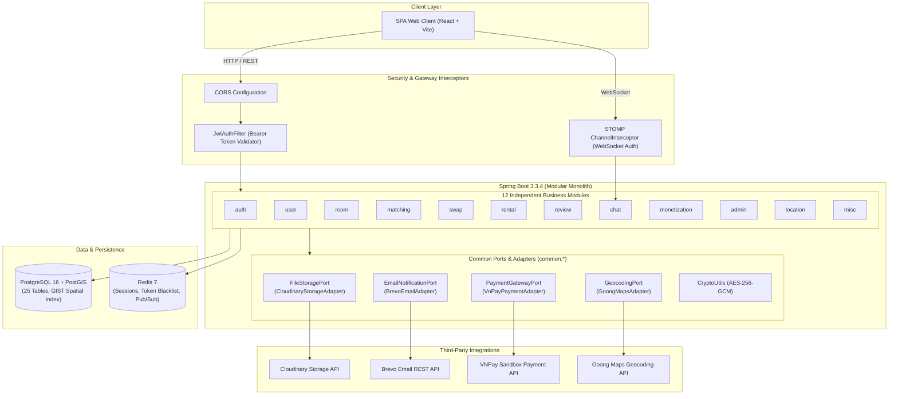

<p align="right">
  <a href="README.md"><b>English</b></a> | <a href="README.vi.md"><b>Tiếng Việt</b></a>
</p>

# PhongTrọXanh.vn — Backend Enterprise Service

> Production-grade **Modular Monolith** backend powering an eco-friendly rental housing and smart roommate matching marketplace in Vietnam, featuring two-way trust scoring (TrustScore), digital rental contracts, and fraud-resistant dynamic QR check-ins.

---

## Tech Stack

<p align="center">
  <a href="https://www.oracle.com/java/"></a>
  <a href="https://spring.io/projects/spring-boot"></a>
  <a href="https://spring.io/projects/spring-security"></a>
  <a href="https://jwt.io/"></a>
  <a href="https://maven.apache.org/"></a>
</p>

<p align="center">
  <a href="https://www.postgresql.org/"></a>
  <a href="https://postgis.net/"></a>
  <a href="https://redis.io/"></a>
  <a href="https://www.docker.com/"></a>
  <a href="https://springdoc.org/"></a>
</p>

<p align="center">
  <a href="https://cloudinary.com/"></a>
  <a href="https://vnpay.vn/"></a>
  <a href="https://www.brevo.com/"></a>
  <a href="https://goong.io/"></a>
  <a href="https://resilience4j.readme.io/"></a>
</p>

---

## 1. Technical Overview & Architectural Decisions

| Aspect | Engineering Choice | Rationale |
| :--- | :--- | :--- |
| **Architecture Pattern** | **Modular Monolith** (12 Bounded Modules) | Domain logic encapsulated into independent bounded contexts inside a single deployable runtime, eliminating microservice networking overhead, serialized DTO overhead, and distributed transaction complexity at current operational scale. |
| **Layering Strategy** | **Pragmatic Layered Architecture** | Strict 4-tier flow: `presentation` $\to$ `application` $\to$ `domain` $\to$ `infrastructure`. Domain entities leverage JPA annotations directly for Hibernate dirty-checking velocity while preserving zero-framework pure domain engines (`MatchingEngine`). |
| **Database & GIS** | PostgreSQL 16 + PostGIS 3.4 Extension | Relational store for 25 normalized tables. Spatial coordinates use `GEOMETRY(Point, 4326)` indexed with `GIST` to execute high-throughput radius queries (`ST_DWithin`) for MapView. |
| **Cache & In-Memory Store** | Redis 7 (Alpine) | Serves 4 specialized workloads: (1) In-memory read caching (view counters, user profiles), (2) Token revocation blacklisting on logout, (3) Atomic counter operations for quota management, (4) STOMP WebSocket pub/sub message broker. |
| **Security & Session** | Stateless JWT (JJWT 0.12.6) + HttpOnly Cookies | 15-minute `AccessToken` kept in client in-memory state to mitigate XSS; 7-day `RefreshToken` secured in `HttpOnly, Secure, SameSite=Lax` cookies; multi-device session revocation coordinated via Redis session hashes. |
| **PII Cryptography** | AES-256-GCM (Hardware-Accelerated) | Citizen Identification Cards (CCCD/CMND) encrypted at rest in the database using authenticated AES-256-GCM with dynamic IVs. Decryption occurs strictly in-memory during KYC verification audits. |
| **Asset Storage** | Cloudinary Cloud Storage | Zero-disk-spooling direct `InputStream` byte streaming from client to Cloudinary under structured paths (`phongtroxanh/{rooms,avatars,kyc,dispute-evidence,misc}`); 100% compliant with PaaS ephemeral filesystems (Render / Railway). |
| **Payment Processing** | VNPay Sandbox Gateway (HMAC-SHA512) | Subscription plans (Free, Pro Tenant, Landlord VIP) and consumable transactions signed with cryptographic hashes; IPN webhooks enforce strict idempotency via PostgreSQL unique constraints. |
| **Transactional Email** | Brevo REST API v3 (HTTPS Port 443) | Outbound transactional emails (OTP, password resets) dispatched over TLS/HTTPS (Port 443), preventing connection timeouts caused by cloud platforms blocking legacy TCP SMTP ports (25, 465, 587). Local fallback to `console` logger supported. |
| **Geocoding & Spatial** | Goong Maps REST API | Fallback geocoding resolving Vietnamese natural language addresses into PostGIS coordinates when landlords post rooms without GPS coordinates; Redis-cached place autocomplete. |
| **Real-time Messaging** | STOMP over WebSocket (`/ws/chat`) | Full-duplex real-time chat with channel-level JWT interceptors, backed by Redis Pub/Sub for cross-connection event dispatching and PostgreSQL persistence for message history. |

---

## 2. System Architecture



---

## 3. Engineering Highlights

### 3.1. 8-Pillar Roommate Compatibility Engine
Rather than relying on arbitrary matching, roommate affinity is evaluated through a deterministic, weighted scoring algorithm (`MatchingEngine`) implemented as a pure domain service:

$$\text{CompatibilityScore} = \sum_{i=1}^{8} (W_i \times S_i) \quad \in [0, 100]$$

| Pillar | Weight ($W_i$) | Evaluation Logic |
| :--- | :---: | :--- |
| **Budget Alignment** | $20\%$ | Overlap percentage between reciprocal target rental budgets. |
| **Geographic Proximity** | $20\%$ | Distance decay function based on PostGIS coordinates of preferred commute zones. |
| **Circadian Rhythm** | $15\%$ | Sleep/wake schedule compatibility (Morning Lark vs Night Owl). |
| **Cleanliness Expectations** | $10\%$ | Alignment on chore distribution and cleanliness thresholds. |
| **Guest Policy** | $10\%$ | Agreement on visitors, parties, and overnight guests. |
| **Smoking / Vaping** | $10\%$ | **Hard Dealbreaker:** If either party is tobacco-intolerant and the other smokes $\to$ **Score is forced to $0$ immediately**. |
| **Noise Tolerance** | $10\%$ | Study habits, music volume, and nighttime noise expectations. |
| **Pet & Lifestyle Habits** | $5\%$ | Affinity regarding domestic pets and shared cooking preferences. |

### 3.2. Concurrency Controls & Race Condition Mitigation
* **Atomic Consumable Deduction (Swipes & Boosts):** To eliminate negative balance bugs caused by concurrent user requests, inventory deductions bypass application-level lock overhead and execute directly via atomic SQL:
  ```sql
  UPDATE user_consumables 
  SET swipes_left = swipes_left - 1 
  WHERE user_id = :userId AND swipes_left > 0;
  ```
  If affected rows equal `0`, the service instantly raises `AppException(CONSUMABLE_EXHAUSTED)`.
* **Idempotent Payment Webhook Handling:** Payment gateways frequently replay IPN notifications during network hiccups. The system enforces a `UNIQUE (idempotency_key)` database constraint on payment transactions, guaranteeing that duplicate webhook deliveries are rejected without double-crediting balances.
* **Room State Isolation:** Entity `Room` implements optimistic locking via `@Version` to resolve simultaneous booking or updating attempts.

### 3.3. Fraud-Resistant Dynamic QR Check-In
The check-in protocol eliminates ghost listings and fraudulent deposit claims:
1. Upon physical arrival at the rental property, the landlord triggers check-in generation.
2. The backend generates a **Single-Use Cryptographic Check-in Token** with a 5-minute TTL, stored in Redis.
3. The tenant scans the QR code via camera $\to$ submits to `POST /api/v1/rentals/{id}/check-in`.
4. The system validates the tenant's real-time GPS coordinates against the property's PostGIS spatial point (must be within 500 meters), verifies token validity, transitions the contract to `CHECKED_IN`, credits **+10 TrustScore** to both parties, and immediately evicts the token to prevent replay attacks.

### 3.4. PII Protection (AES-256-GCM)
* Citizen identification numbers (`id_card_number`) in `user_verifications` are stored encrypted with **AES-256-GCM** using authenticated additional data (AAD) and non-repeating initialization vectors (IV).
* Encryption keys are injected exclusively via environment variables. Database administrators and raw SQL backups cannot access plaintext identification data.

---

## 4. Bounded Contexts & Module Catalog

```
d:\EXE\backend\src\main\java\vn\phongtroxanh\backend
├── common/                             # Cross-Cutting Infrastructure & Ports
│   ├── config/                         # Redis, OpenAPI, WebMvc Configurations
│   ├── dto/                            # Uniform ApiResponse envelope & ProblemDetail
│   ├── entity/                         # BaseEntity (UUID, Timestamps)
│   ├── exception/                      # AppException, ErrorCode, GlobalExceptionHandler
│   ├── location/                       # GeocodingPort, GoongMapsAdapter
│   ├── mail/                           # EmailNotificationPort, BrevoEmailAdapter
│   ├── payment/                        # PaymentGatewayPort, VnPayPaymentAdapter
│   ├── repository/                     # Base persistence interfaces
│   ├── security/                       # JwtTokenProvider, JwtAuthFilter, UserPrincipal
│   ├── storage/                        # FileStoragePort, CloudinaryStorageAdapter
│   └── util/                           # AES-256 CryptoUtils, Constants
└── modules/                            # 12 Independent Domain Modules
    ├── admin/                          # System KPIs, KYC Audit, Moderation, Dispute Arbitration
    ├── auth/                           # Registration, Login, Token Rotation, OTP, Google OAuth2
    ├── chat/                           # REST Chat History + Real-time STOMP WebSocket (/ws/chat)
    ├── location/                       # Vietnamese Address Autocomplete, Geocoding & Reverse Geocoding
    ├── matching/                       # Discovery Feed, Swipe Interactions, Mutual Match Detection
    ├── misc/                           # Public Landing Statistics
    ├── monetization/                   # Subscription Plans, VNPay Sandbox Checkout, IPN Consumer
    ├── notification/                   # In-App Notifications, FCM Token Registry
    ├── rental/                         # Contracts, Dynamic Check-in QR Token, Replay Protection
    ├── review/                         # Two-Way Reviews, Evidence Uploads, Dispute Management
    ├── room/                           # Room CRUD, PostGIS Radius Search (ST_DWithin), Boost Management
    ├── swap/                           # Room Swapping & Subleasing Marketplace, Landlord Approvals
    └── user/                           # User Profiles, Avatar Uploads, TrustScore, KYC Submission
```

### API Endpoint Distribution Across Modules

| Module | Base Route | Endpoints | Domain Scope |
| :--- | :--- | :---: | :--- |
| **Auth & Onboarding** | `/api/v1/auth` | **11** | Registration, Authentication, OTP Dispatch, Token Rotation, Google OAuth2, Multi-step Onboarding. |
| **User & KYC** | `/api/v1/users` | **12** | Profile management, Avatar uploads, Matching preferences matrix, TrustScore details, AES-256 KYC submission. |
| **Room & Spatial** | `/api/v1/rooms` | **15** | Room search, PostGIS MapView (`ST_DWithin`), Side-by-side comparison, Bookmarking, Room CRUD, Boost 7 days. |
| **Matching Engine** | `/api/v1/matching` | **8** | Discovery feed, Card swiping (LIKE/DISLIKE/SUPER_LIKE), Mutual match detection, Match unlinking. |
| **Room Swap** | `/api/v1/swaps` | **5** | Lease transfer listings, Search listings, Proposal dispatch, Landlord arbitration and approval. |
| **Rentals & QR** | `/api/v1/rentals` | **7** | Rental requests, Electronic contracts, Dynamic single-use check-in QR generation, Physical check-in validation. |
| **Reviews & Disputes** | `/api/v1/reviews` | **8** | Two-way rental evaluations, Dispute evidence attachment, Public responses, Dispute claims. |
| **Real-time Chat** | `/api/v1/chat` + WS | **5 + 1 WS** | Conversation registry, Historical message retrieval, REST dispatch & STOMP messaging via `/ws/chat`. |
| **Monetization** | `/api/v1/monetization` | **7** | Tiered plan catalogue, VNPay payment URL generation, Asynchronous IPN webhook handling, Transaction logs. |
| **Admin Control** | `/api/v1/admin` | **12** | Executive KPI dashboard, KYC CCCD decryption audit, User moderation, Room verification, Dispute resolution. |
| **Location Services** | `/api/v1/locations` | **3** | Vietnamese address autocomplete (24h Redis cache), Forward & Reverse Geocoding. |
| **Public Statistics** | `/api/v1/misc` | **1** | Public landing page metrics (active rooms, successful matches, satisfaction index). |
| **Total** | | **105 REST + 1 WS** | **100% compliant** with RFC 9457 Problem Details and `ApiResponse<T>` envelope. |

---

## 5. Database Architecture

The persistence model consists of **25 relational tables**, all utilizing `UUID v4` (`gen_random_uuid()`) primary keys to prevent enumeration attacks and support distributed scalability:

* **Identity & Security:** `users`, `user_matching_profiles`, `user_trust_scores`, `user_verifications`, `user_settings`.
* **Real Estate & Spatial:** `rooms` (includes `location geometry(Point, 4326)`), `room_images`, `room_fees`, `saved_rooms`.
* **Social & Matching:** `user_swipes`, `roommate_matches`, `room_swaps`, `swap_requests`.
* **Contracts & Quality:** `rental_contracts`, `rental_reviews`, `review_evidence`, `review_disputes`.
* **Billing & Monetization:** `subscription_plans`, `user_subscriptions`, `user_consumables`, `payment_transactions`.
* **Communication:** `chat_conversations`, `chat_messages`, `notifications`.

The production schema, GiST/B-tree indexes, and automated timestamp triggers are maintained in [`docs/DATABASE_SCHEMA.sql`](./docs/DATABASE_SCHEMA.sql).

---

## 6. Local Setup & Execution Guide

### Prerequisites
* **Java:** OpenJDK 21 LTS or newer.
* **Build Tool:** Apache Maven 3.9+ (or use the bundled `mvnw.cmd` / `mvnw`).
* **Docker & Docker Compose:** For running PostgreSQL (PostGIS) and Redis locally.

### Step 1: Start PostgreSQL and Redis via Docker Compose
From the backend repository root:
```bash
docker compose up -d
```
Verify container health:
```bash
docker compose ps
```
* Container `phongtroxanh-postgres` runs on port `5433` (pre-configured with PostGIS extension and initialized schema).
* Container `phongtroxanh-redis` runs on port `6379`.

### Step 2: Configure Environment Variables (.env)
Copy the template configuration:
```bash
cp .env.example .env
```
Ensure required parameters are populated:
```properties
SPRING_PROFILES_ACTIVE=dev
SERVER_PORT=8080
DB_HOST=localhost
DB_PORT=5433
DB_NAME=phongtroxanh_db
DB_USER=postgres
DB_PASSWORD=postgrespassword

REDIS_HOST=localhost
REDIS_PORT=6379

# JWT HS512 Secret (Minimum 64 characters)
JWT_SECRET=4c6f6e675f616e645f73757065725f7365637265745f6a77745f6b65795f666f725f70686f6e6774726f78616e685f766e5f68733531325f73656375726974795f746f6b656e

# VNPay Sandbox Gateway
VNPAY_TMN_CODE=TESTVNPAY
VNPAY_HASH_SECRET=TESTHASHSECRET1234567890ABCDEF1234567890ABCDEF1234567890ABCDEF

# Email (Select 'console' for local testing or 'brevo' with BREVO_API_KEY)
MAIL_PROVIDER=console

# Cloudinary Credentials
CLOUDINARY_CLOUD_NAME=your_cloud_name
CLOUDINARY_API_KEY=your_api_key
CLOUDINARY_API_SECRET=your_api_secret

# Goong Maps API
GOONG_API_KEY=your_goong_api_key
```

### Step 3: Build & Run Unit Tests
Compile 199 source files and execute automated tests:
```bash
# Windows
.\mvnw.cmd clean compile
.\mvnw.cmd test

# Linux / macOS
./mvnw clean compile
./mvnw test
```

### Step 4: Launch the Backend Server
```bash
# Windows
.\mvnw.cmd spring-boot:run

# Linux / macOS
./mvnw spring-boot:run
```
The application server listens at: `http://localhost:8080`

### Step 5: Access Documentation & Observability
* **Swagger UI (OpenAPI 3):** `http://localhost:8080/swagger-ui.html`
* **OpenAPI Specification (JSON):** `http://localhost:8080/v3/api-docs`
* **Spring Actuator Health:** `http://localhost:8080/actuator/health`

---

## 7. Quality Assurance & Automated Testing

The repository provides 3 independent levels of automated verification:

1. **Unit & Integration Test Suite (JUnit 5 + Mockito):**
   * Command: `.\mvnw.cmd test`
   * Validates Spring Boot context initialization, `AesGcmEncryptionConverter` cryptographic rounds, and `MatchingEngine` compatibility math.
2. **Fast Live E2E Smoke Test ([`scripts/e2e_smoke_test.py`](./scripts/e2e_smoke_test.py)):**
   * Validates 14 sequential core user journeys: Registration $\to$ Login $\to$ Property Creation $\to$ PostGIS Radius Query $\to$ Contract Execution $\to$ QR Check-in $\to$ Review Posting $\to$ Monetization.
   * Zero external dependencies (uses standard Python 3 `urllib`):
     ```bash
     python scripts/e2e_smoke_test.py
     ```
3. **Comprehensive API Matrix Test Runner ([`scripts/test_full_api_matrix.py`](./scripts/test_full_api_matrix.py)):**
   * Executes **184 test cases across all 105 API endpoints**, auditing Happy Paths, RBAC violations (403), BOLA authorization violations (403), and Input Validation boundaries (400).
   * Verified with **Zero 500 Internal Server Errors** (see [`docs/TEST_REPORT.md`](./docs/TEST_REPORT.md)).
4. **Unhappy & Security Defenses Test ([`scripts/test_unhappy_paths.py`](./scripts/test_unhappy_paths.py)):**
   * Penetration testing for malicious tokens, cross-tenant IDOR/BOLA tampering, invalid request formats, and OTP spam abuse.

---

## 8. Technical Documentation Index

All engineering specifications and architectural standards reside in [`docs/`](./docs/):

* [`SYSTEM_SPECIFICATION.md`](./docs/SYSTEM_SPECIFICATION.md): Comprehensive functional requirements and endpoint catalog.
* [`CODING_RULES.md`](./docs/CODING_RULES.md): 26 chapters covering architecture rules, naming standards, and Definition of Done.
* [`ARCHITECTURE_DECISIONS.md`](./docs/ARCHITECTURE_DECISIONS.md): 11 Architecture Decision Records (ADR-001 through ADR-011).
* [`DATABASE_SCHEMA.sql`](./docs/DATABASE_SCHEMA.sql): DDL creating all 25 relational tables, PostGIS extensions, indexes, and triggers.
* [`THIRD_PARTY_INTEGRATION_GUIDE.md`](./docs/THIRD_PARTY_INTEGRATION_GUIDE.md): Setup guide for Cloudinary, Brevo, Goong Maps, and VNPay Sandbox.
* [`TEST_REPORT.md`](./docs/TEST_REPORT.md): Quantitative verification report across the 105-endpoint matrix.
* [`CODEBASE_OVERVIEW.md`](./docs/CODEBASE_OVERVIEW.md): In-depth system architecture guide for incoming engineers.
