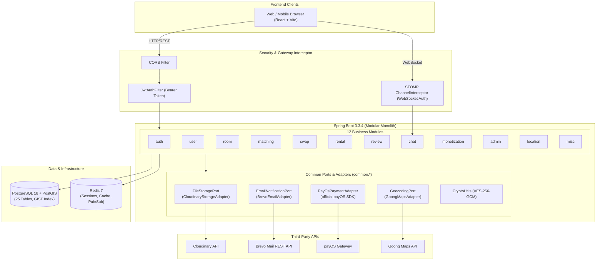

<p align="right">
  <a href="README.md"><b>English</b></a> | <a href="README.vi.md"><b>Tiếng Việt</b></a>
</p>

# PhongTrọXanh.vn — Backend Service

> Backend **Modular Monolith** phục vụ tìm phòng trọ, ghép đôi bạn cùng phòng, chấm điểm tín nhiệm và quản lý hồ sơ thuê kèm xác nhận nhận phòng. Hiện chưa có sinh PDF hợp đồng hoặc nhà cung cấp ký điện tử.

Kết quả MVP: [luồng đã kiểm thử và giới hạn](docs/backend-verification.md). Cấu hình thanh toán: [payOS](docs/payos-setup.md). Hướng dẫn VNPay cũ được thay bằng tài liệu payOS này.

---

## Tech Stack

<p align="center">
  <a href="https://www.oracle.com/java/"></a>
  <a href="https://spring.io/projects/spring-boot"></a>
  <a href="https://spring.io/projects/spring-security"></a>
  <a href="https://jwt.io/"></a>
  <a href="https://maven.apache.org/"></a>
</p>

<p align="center">
  <a href="https://www.postgresql.org/"></a>
  <a href="https://postgis.net/"></a>
  <a href="https://redis.io/"></a>
  <a href="https://www.docker.com/"></a>
  <a href="https://springdoc.org/"></a>
</p>

<p align="center">
  <a href="https://cloudinary.com/"></a>
  <a href="https://payos.vn/"></a>
  <a href="https://www.brevo.com/"></a>
  <a href="https://goong.io/"></a>
  <a href="https://resilience4j.readme.io/"></a>
</p>

---

## 1. Tổng Quan Kỹ Thuật (Architecture Overview)

| Hạng mục | Quyết định & Công nghệ | Giải trình kỹ thuật |
| :--- | :--- | :--- |
| **Kiến trúc ứng dụng** | **Modular Monolith** (12 modules biệt lập) | Đóng gói nghiệp vụ theo ranh giới miền (Bounded Contexts) nhưng chạy trong một runtime duy nhất; loại bỏ chi phí vận hành mạng và distributed transactions của Microservices ở quy mô hiện tại. |
| **Mô hình phân tầng** | **Pragmatic Layered Architecture** | 4 tầng: `presentation` $\to$ `application` $\to$ `domain` $\to$ `infrastructure`. Cho phép Entity sử dụng trực tiếp JPA annotations để tận dụng Hibernate Dirty Checking, giảm tối đa boilerplate chuyển đổi POJO. |
| **Cơ sở dữ liệu** | PostgreSQL 18 (Alpine) + Extension PostGIS 3.4 | CSDL quan hệ chính lưu 25 bảng thực thể. Cột `location` kiểu `GEOMETRY(Point, 4326)` được đánh chỉ mục không gian `GIST` để tính bán kính `ST_DWithin` phục vụ MapView. |
| **Bộ nhớ đệm & Broker** | Redis 7 (Alpine) | Đóng 4 vai trò: (1) In-Memory Cache (view count, matching profile), (2) Token Blacklist khi Logout, (3) Atomic Counters (trừ lượt quẹt/đẩy tin), (4) Message Broker cho WebSocket STOMP. |
| **Xác thực & Phiên** | Stateless JWT (JJWT 0.12.6) + HttpOnly Cookie | `AccessToken` (15 phút) nằm ở Client Memory chống XSS; `RefreshToken` (7 ngày) lưu trong HttpOnly, Secure, SameSite=Lax Cookie; quản lý phiên qua Redis key `auth:refresh-session:{sessionId}`. |
| **Bảo mật PII** | AES-256-GCM (Java Cryptography) | Số căn cước công dân (CCCD) được mã hóa trước khi ghi vào database. Khóa bí mật lấy từ biến môi trường, chỉ giải mã in-memory khi Admin vào luồng duyệt hồ sơ KYC. |
| **Lưu trữ tệp tin** | Cloudinary Cloud Storage | Upload stream trực tiếp qua `InputStream` lên Cloudinary theo phân cấp cha-con (`phongtroxanh/{rooms,avatars,kyc,dispute-evidence,misc}`); không ghi đĩa tạm, tương thích hoàn toàn PaaS Ephemeral Filesystem (Render/Railway). |
| **Cổng thanh toán** | payOS (SDK Java chính thức, webhook ký HMAC) | Thanh toán nạp gói hội viên (Free, Pro Tenant, Landlord VIP) và lượt consumable. Webhook ký hợp lệ khóa giao dịch và cộng quyền lợi một lần cho mỗi đơn. |
| **Email dịch vụ** | Brevo REST API v3 (Port 443 HTTPS) | Gửi OTP đăng ký, cấp lại mật khẩu qua giao thức HTTPS. Giải quyết triệt để lỗi timeout do bị chặn cổng TCP SMTP (25, 465, 587) trên môi trường Cloud miễn phí. Hỗ trợ fallback `console` cho local dev. |
| **Bản đồ & Tọa độ** | Goong Maps REST API | Geocoding chuyển địa chỉ tiếng Việt thành tọa độ PostGIS khi chủ trọ đăng phòng thiếu tọa độ; Autocomplete địa chỉ có Redis cache 24h. |
| **Realtime Chat** | STOMP over WebSocket (`/ws/chat`) | Client trao đổi tin nhắn trực tiếp qua WebSocket; Redis Pub/Sub điều phối sự kiện giữa các kết nối; lưu trữ lịch sử tin nhắn trong PostgreSQL. |

---

## 2. Sơ Đồ Kiến Trúc Hệ Thống (System Architecture)



---

## 3. Giải Pháp Xử Lý Các Bài Toán Hóc Búa (Engineering Highlights)

### 3.1. Thuật toán Ghép đôi Bạn cùng phòng 8 Trụ Cột (Matching Engine)
Hệ thống không dùng match ngẫu nhiên mà tính điểm tương thích có trọng số thông qua `MatchingEngine` thuần túy (Pure Domain Service):

$$\text{MatchingScore} = \sum_{i=1}^{8} (W_i \times S_i) \quad \in [0, 100]$$

1. **Ngân sách (Budget - $W=20$):** Độ giao thoa khoảng giá thuê mong muốn giữa 2 bên.
2. **Khu vực (Location - $W=20$):** Khoảng cách địa lý giữa 2 vị trí ưu tiên (dùng hàm Haversine/PostGIS).
3. **Giờ giấc sinh hoạt (Sleep Schedule - $W=15$):** Tương quan giờ đi ngủ và thức dậy (Cú đêm vs Dậy sớm).
4. **Mức độ vệ sinh (Cleanliness - $W=10$):** Kỳ vọng về độ sạch sẽ và phân công dọn dẹp.
5. **Tiếp khách & Bạn bè (Guest Policy - $W=10$):** Thói quen dẫn bạn bè/người yêu về phòng.
6. **Thuốc lá & Chất kích thích (Smoking - $W=10$ - Dealbreaker):** Nếu một bên dị ứng khói thuốc mà bên kia hút thuốc $\to$ **Điểm phạt ngay lập tức về 0**.
7. **Độ ồn & Sinh hoạt (Noise Tolerance - $W=10$):** Thói quen bật nhạc, gọi điện, học bài đêm.
8. **Sở thích & Lối sống (Interests - $W=5$):** Sở thích nuôi thú cưng, nấu ăn, thể thao.

### 3.2. Chống Race Condition & Quản Trị Concurrency (Concurrency Defenses)
* **Trừ lượt vuốt (Swipe) & Lượt đẩy tin (Boost):** Sử dụng **Atomic SQL Update** có điều kiện ở tầng database:
  ```sql
  UPDATE user_consumables 
  SET swipes_left = swipes_left - 1 
  WHERE user_id = :userId AND swipes_left > 0;
  ```
  Nếu kết quả trả về `0 rows affected`, hệ thống ném `AppException(CONSUMABLE_EXHAUSTED)` ngay lập tức; không xảy ra hiện tượng quẹt âm số dư khi người dùng spam click.
* **Xử lý webhook payOS (Idempotency):** Handler khóa đơn và chỉ cộng quyền lợi khi PENDING; gửi lại SUCCESS được xác nhận mà không cộng lặp. Header Idempotency-Key tránh tạo checkout mới khi retry.
* **Xung đột trạng thái phòng trọ:** Sử dụng **Optimistic Locking (`@Version`)** trên entity `Room` để ngăn chặn hai người cùng đặt cọc hoặc đổi trạng thái phòng tại cùng một thời điểm.

### 3.3. Quy Trình Xác Nhận Nhận Phòng & Bàn Giao (Check-in Handover)
Quy trình giao nhận phòng và kích hoạt hợp đồng:
1. Khi đến nhận phòng, Chủ trọ kiểm tra hiện trạng và bấm nút **"Bàn giao phòng"** (`HANDOVER`) trên giao diện quản lý người thuê.
2. Người thuê xác nhận tại mục **"Hợp đồng thuê của tôi"** (`CONFIRM`).
3. Backend kiểm tra tính hợp lệ của hợp đồng, chuyển trạng thái sang `CHECKED_IN`, đồng thời tự động chuyển phòng sang `RENTED` (ẩn khỏi danh sách tìm phòng) và **cộng điểm tín nhiệm (+10 TrustScore)** cho cả hai bên.
4. Hệ thống cũng duy trì endpoint dự phòng hỗ trợ mã xác nhận động khi cần xác minh thêm.

### 3.4. Mã Hóa Bảo Vệ Dữ Liệu Nhạy Cảm (PII Encryption)
* Căn cước công dân (CCCD/CMND) và ảnh giấy tờ pháp lý là dữ liệu nhạy cảm cao.
* Cột `id_card_number` trong bảng `user_verifications` được mã hóa đối xứng qua thuật toán **AES-256-GCM** kèm vector khởi tạo ngẫu nhiên (IV).
* Khóa bí mật được inject từ biến môi trường (`AES_SECRET_KEY`), Database Administrator hoặc người dump CSDL không thể nhìn thấy số thẻ CCCD dưới dạng văn bản thô (Plaintext).

---

## 4. Danh Mục 12 Modules Nghiệp Vụ

```
d:\EXE\backend\src\main\java\vn\phongtroxanh\backend
├── common/                             # Shared Infrastructure, Ports & Adapters
│   ├── config/                         # Redis, OpenAPI Swagger, WebMvc
│   ├── dto/                            # ApiResponse uniform envelope, ProblemDetail
│   ├── entity/                         # BaseEntity (UUID, Timestamps)
│   ├── exception/                      # AppException, ErrorCode, GlobalExceptionHandler
│   ├── location/                       # GeocodingPort, GoongMapsAdapter
│   ├── mail/                           # EmailNotificationPort, BrevoEmailAdapter
│   ├── payment/                        # PayOsPaymentAdapter (official SDK)
│   ├── repository/                     # Base repositories
│   ├── security/                       # JwtTokenProvider, JwtAuthFilter, UserPrincipal
│   ├── storage/                        # FileStoragePort, CloudinaryStorageAdapter
│   └── util/                           # AES-256 CryptoUtils, Constants
└── modules/                            # 12 Independent Business Modules
    ├── admin/                          # Dashboard KPI, Duyệt KYC CCCD, Quản lý User/Room, Phán quyết Dispute
    ├── auth/                           # Đăng ký, Đăng nhập, Token Rotation, OTP, Google OAuth2, Onboarding
    ├── chat/                           # Lịch sử hội thoại REST + Real-time STOMP WebSocket (/ws/chat)
    ├── location/                       # Goong Maps Autocomplete, Geocoding & Reverse Geocoding
    ├── matching/                       # Discovery Feed, Quẹt thẻ (Swipe), Mutual Match, MatchingEngine 8 trụ cột
    ├── misc/                           # Thống kê công khai trang chủ (Landing stats)
    ├── monetization/                   # Gói cước (Plans), Thanh toán payOS, Consumables
    ├── notification/                   # Thông báo In-App, Đăng ký FCM Device Token
    ├── rental/                         # Hợp đồng thuê, xác nhận bàn giao nhận phòng 1-click hoặc OTP
    ├── review/                         # Đánh giá 2 chiều sau thuê, Upload bằng chứng đối chất, Khiếu nại
    ├── room/                           # CRUD Phòng, PostGIS MapView (ST_DWithin), Boost phòng 7 ngày, So sánh
    ├── swap/                           # Đăng tin hoán đổi/nhượng phòng (Pass phòng), Đề xuất, Duyệt chủ trọ
    └── user/                           # Hồ sơ cá nhân, Upload avatar, TrustScore 4 tầng, Nộp KYC CCCD
```

### Thống Kê API Endpoints Theo Module

| Module | Base Path | Số lượng API | Mô tả phạm vi nghiệp vụ |
| :--- | :--- | :---: | :--- |
| **Auth & Onboarding** | `/api/v1/auth` | **11** | Đăng ký, Đăng nhập, Gửi/Xác thực OTP, Quên mật khẩu, Token Rotation, Google OAuth2, Onboarding Tenant & Landlord. |
| **User & KYC** | `/api/v1/users` | **12** | Xem/sửa hồ sơ, upload avatar, ma trận thói quen matching, tra cứu TrustScore, nộp CCCD mã hóa AES-256. |
| **Room & Spatial** | `/api/v1/rooms` | **15** | Tìm kiếm phòng trọ, PostGIS MapView, so sánh phòng, bookmark yêu thích, CRUD phòng của chủ trọ, upload ảnh, boost phòng. |
| **Matching Engine** | `/api/v1/matching` | **8** | Discovery feed bạn cùng phòng, quẹt hồ sơ (LIKE/DISLIKE/SUPER_LIKE), phát hiện mutual match, danh sách kết đôi. |
| **Room Swap** | `/api/v1/swaps` | **5** | Đăng tin hoán đổi/nhượng phòng, tìm kiếm tin pass phòng, gửi đề xuất hoán đổi, chủ trọ phê duyệt. |
| **Rentals & Deposits** | `/api/v1/rentals` | **7** | Tạo yêu cầu thuê, hồ sơ thuê, xác nhận nhận phòng/bàn giao 1-click kích hoạt hợp đồng. |
| **Reviews & Disputes** | `/api/v1/reviews` | **8** | Đánh giá 2 chiều sau thuê, upload ảnh bằng chứng, phản hồi đánh giá, gửi đơn khiếu nại đánh giá sai sự thật. |
| **Realtime Chat** | `/api/v1/chat` + WS | **5 + 1 WS** | Lấy danh sách hội thoại, lịch sử tin nhắn, gửi tin nhắn REST & STOMP WebSocket qua endpoint `/ws/chat`. |
| **Monetization** | `/api/v1/monetization` | **7** | Danh sách gói dịch vụ, tạo URL thanh toán payOS, xác minh webhook, lịch sử giao dịch. |
| **Admin Control** | `/api/v1/admin` | **12** | Thống kê KPI, duyệt hồ sơ CCCD (giải mã AES in-memory), khóa/mở user, duyệt tích xanh phòng, xử lý khiếu nại. |
| **Location Services** | `/api/v1/locations` | **3** | Autocomplete địa chỉ Việt Nam (Redis cache 24h), Geocoding tọa độ, Reverse-Geocoding. |
| **Landing Stats** | `/api/v1/misc` | **1** | Thống kê số phòng, số lượt ghép đôi thành công, tỷ lệ hài lòng phục vụ trang chủ. |
| **Tổng cộng** | | **105 REST + 1 WS** | Toàn bộ đều tuân thủ chuẩn RFC 9457 Problem Details và envelope `ApiResponse<T>`. |

---

## 5. Cơ Sở Dữ Liệu & Migrations (Database Architecture)

Cơ sở dữ liệu được quản lý tự động qua **Flyway Migrations** gồm **25 bảng quan hệ**, toàn bộ sử dụng UUID v4 (gen_random_uuid()) làm khóa chính để chống lộ số lượng bản ghi kinh doanh và tương thích chuẩn phân tán:

* **Nhóm Người Dùng & Bảo Mật:** users, user_matching_profiles, user_trust_scores, user_verifications, user_settings.
* **Nhóm Phòng Trọ & Không Gian:** 
ooms (chứa cột location geometry(Point, 4326)), 
oom_images, 
oom_fees, saved_rooms, 
oom_swipes.
* **Nhóm Ghép Đôi & Hoán Đổi:** user_swipes, 
oommate_matches, 
oom_swaps, swap_requests.
* **Nhóm Hợp Đồng & Đánh Giá:** 
ental_contracts, 
ental_reviews, 
eview_evidence, 
eview_disputes.
* **Nhóm Giao Dịch & Gói Cước:** subscription_plans, user_subscriptions, user_consumables, payment_transactions, payos_order_code_seq.
* **Nhóm Trò Chuyện & Tương Tác:** chat_conversations, chat_messages, 
otifications.

### Bộ Script Migration Chuẩn Hóa (src/main/resources/db/migration/)
1. **V1__init_schema.sql**: Khởi tạo DDL bảng, PostGIS extension, kiểu ENUM và khóa ngoại toàn hệ thống.
2. **V2__seed_system_data.sql**: Nạp dữ liệu mẫu chuẩn cho các gói đăng tin/hội viên (Free, Pro Tenant, Landlord VIP), loại phòng và tài khoản Admin mặc định (dmin@phongtroxanh.vn).
3. **V3__postgis_spatial_and_indexes.sql**: Đánh chỉ mục không gian GiST cho truy vấn bán kính ST_DWithin, trigger tự động đồng bộ geometry và ràng buộc chống trùng lặp giao dịch thanh toán.

---

## 6. Hướng Dẫn Cài Đặt & Chạy Ứng Dụng (Local Development)

### Yêu Cầu Tiên Quyết
* **Java:** OpenJDK 21 LTS trở lên.
* **Build Tool:** Apache Maven 3.9+ (hoặc dùng wrapper mvnw.cmd / mvnw đi kèm).
* **Docker & Docker Compose:** Để khởi động PostgreSQL (PostGIS) và Redis cục bộ.

### Bước 1: Khởi động CSDL và Redis qua Docker
Từ thư mục gốc của backend, khởi chạy hai container:
`ash
docker compose up -d
`
Kiểm tra trạng thái container:
`ash
docker compose ps
`
* Container phongtroxanh-postgres chạy tại cổng 5433 (đã nạp sẵn PostGIS extension). Flyway sẽ tự động migrate các file V1-V3 khi ứng dụng Spring Boot khởi động.
* Container phongtroxanh-redis chạy tại cổng 6379.

### Bước 2: Thiết lập biến môi trường (.env)
Tạo file .env từ file mẫu:
`ash
cp .env.example .env
`
Cấu hình các thông số tối thiểu:
`properties
SPRING_PROFILES_ACTIVE=dev
SERVER_PORT=8080
DB_HOST=localhost
DB_PORT=5433
DB_NAME=phongtroxanh_db
DB_USER=postgres
DB_PASSWORD=postgrespassword

REDIS_HOST=localhost
REDIS_PORT=6379

# JWT HS512 secret (ít nhất 64 ký tự)
JWT_SECRET=4c6f6e675f616e645f73757065725f7365637265745f6a77745f6b65795f666f725f70686f6e6774726f78616e685f766e5f68733531325f73656375726974795f746f6b656e

# Cổng thanh toán payOS (VietQR ngân hàng tự động)
PAYOS_CLIENT_ID=your_client_id
PAYOS_API_KEY=your_api_key
PAYOS_CHECKSUM_KEY=your_checksum_key

# Email (chọn 'console' để in ra log khi test local hoặc 'brevo' kèm BREVO_API_KEY)
MAIL_PROVIDER=console

# Cloudinary (Lấy từ Cloudinary Dashboard)
CLOUDINARY_CLOUD_NAME=your_cloud_name
CLOUDINARY_API_KEY=your_api_key
CLOUDINARY_API_SECRET=your_api_secret

# Goong Maps API
GOONG_API_KEY=your_goong_api_key
`

### Bước 3: Biên dịch & Chạy bộ kiểm thử tự động
Biên dịch mã nguồn và chạy toàn bộ 22 bộ kiểm thử tự động:
`ash
# Windows
.\mvnw.cmd clean compile
.\mvnw.cmd test

# Linux / macOS
./mvnw clean compile
./mvnw test
`

### Bước 4: Khởi chạy Backend Server
`ash
# Windows
.\mvnw.cmd spring-boot:run

# Linux / macOS
./mvnw spring-boot:run
`
Ứng dụng sẽ lắng nghe tại: http://localhost:8080

### Bước 5: Truy cập Tài Liệu API & Health Check
* **Swagger UI (OpenAPI 3):** http://localhost:8080/swagger-ui.html
* **OpenAPI Specification (JSON):** http://localhost:8080/v3/api-docs
* **Spring Actuator Health:** http://localhost:8080/actuator/health

---

## 7. Kiểm Thử & Đảm Bảo Chất Lượng (Quality Assurance)

Hệ thống được bảo vệ bởi **22 bộ kiểm thử tự động toàn diện** đặt tại src/test/java/vn/phongtroxanh/backend/:

* **Cổng Thanh Toán & PayOS Integration:**
  - PayOsSignatureTest: Kiểm tra thuật toán băm HMAC SHA-256 xác thực chữ ký webhook.
  - PayOsFlowIntegrationTest: Luồng tạo link thanh toán VietQR, tính lũy kế idempotency và cập nhật trạng thái đơn hàng.
  - PaymentServiceTest: Kiểm thử bảng giá gói hội viên và kiểm toán lịch sử giao dịch.
* **Xử Lý Đồng Thời & Race Conditions:**
  - ConcurrentMatchingDatabaseTest: Mô phỏng nhiều người dùng cùng quẹt ghép đôi một thời điểm.
  - DailySwipeQuotaDatabaseTest: Kiểm tra câu lệnh atomic SQL trừ quota, đảm bảo không âm số lượt quẹt.
  - AuthRaceIntegrationTest: Chống đăng ký trùng lặp tài khoản khi có request song song.
* **Bảo Mật & Phân Quyền:**
  - AuthSecurityRegressionTest: Kiểm tra luồng cấp lại AccessToken và từ chối token giả mạo.
  - ChatSecurityRegressionTest: Phân quyền channel WebSocket STOMP, cô lập dữ liệu chat giữa các cặp người dùng.
  - AccessSecurityRegressionTest: Kiểm soát quyền truy cập theo vai trò (ROLE_TENANT, ROLE_LANDLORD, ROLE_ADMIN).
* **Nghiệp Vụ Cốt Lõi & Hàng Đợi KYC:**
  - AdminIntegrityTest: Kiểm tra tính toán số liệu thống kê Dashboard và phân trang hàng đợi duyệt CCCD.
  - RoomServiceTest & RoomRequestValidationTest: Kiểm tra tìm kiếm không gian PostGIS và thuật toán pHash chống trùng ảnh phòng.
  - RentalServiceTest & RoomSwapServiceTest: Vòng đời hợp đồng thuê, xác nhận bàn giao check-in và phê duyệt đổi phòng.
  - ReviewIntegrityTest: Tính điểm tín nhiệm 2 chiều và quy trình xử lý khiếu nại đánh giá.

Chạy toàn bộ test suites:
`powershell
mvn clean test
`

---

## 8. Tài Liệu Kỹ Thuật Bổ Trợ (Documentation Index)

Tài liệu thiết kế được lưu trữ trong thư mục [docs/](./docs/):

* [system-specification.md](./docs/system-specification.md): Đặc tả chi tiết 105 API endpoints và quy tắc nghiệp vụ.
* [coding-rules.md](./docs/coding-rules.md): 26 chương quy chuẩn kiến trúc, quy tắc phân lớp, chuẩn đặt tên và Definition of Done.
* [rchitecture-decisions.md](./docs/architecture-decisions.md): 11 bản ghi quyết định kiến trúc (ADR-001 đến ADR-011).
* [payos-setup.md](./docs/payos-setup.md): Hướng dẫn kết nối cổng thanh toán PayOS VietQR và xử lý webhook.
* [	hird-party-integrations.md](./docs/third-party-integrations.md): Hướng dẫn chi tiết đăng ký credentials cho Cloudinary, Brevo, Goong Maps, Google OAuth và payOS.
* [ackend-verification.md](docs/backend-verification.md): Báo cáo bằng chứng kiểm thử các luồng chức năng thực tế.
* [codebase-overview.md](./docs/codebase-overview.md): Tài liệu phân tích kiến trúc hệ thống chuyên sâu cho lập trình viên.
